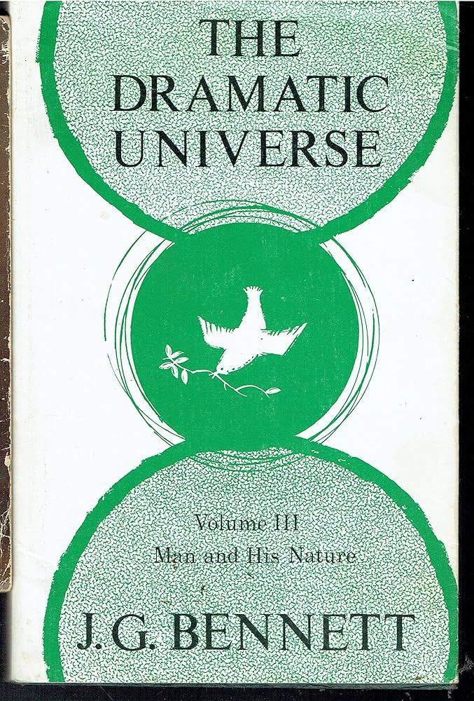
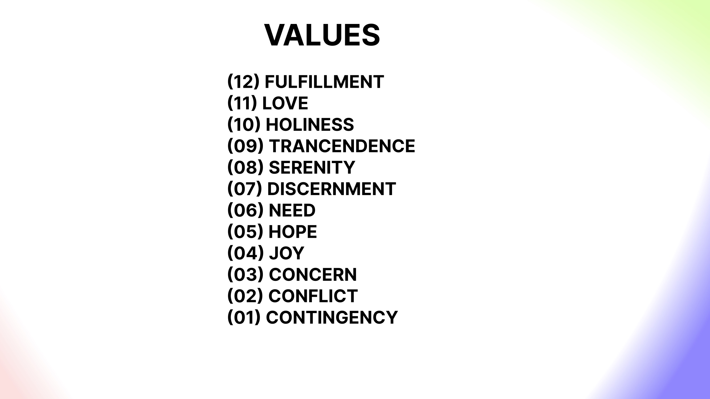

+++
authors = ["Josh Fairhead"]
title = "The Dramatic Universe Vol. 3: Man and His Nature"
date = 2026-05-04
description = "A review of John Bennett's third volume of The Dramatic Universe"
[taxonomies]
tags = ["Books"]
[extra]
card = "cover.jpg"
hero = false

+++

The dramatic universe volume three is titled 'man and his nature', which essentially builds upon the foundations of the first and second books, already covered. These are the foundations of natural philosophy and the foundations of moral philosophy.

This third book was something rather different in that it is more grounded than the other books which aim to establish a schema of the entire cosmos. These foundations having already been laid, now enable us to broadly cover mans place within the context of the bigger picture.

Firstly, we cover the domain of values which are partitioned into a triad of 'material, vital and cosmic'. These are each turned into a tetrad, which taken together give us twelve in total:

We then move into a section with regards to the coalesence of these values for realisation in the domain of harmony. That is we take each of the three tetrads and create triads from each of their terms so that contingency, hope and trancendence become the value of beauty. Conflict, need and holiness become goodness. Concern, discernment and love becomes mercy. Joy, serenity and fulfilment become truth. An example of value realisation is then given before we move on to a section of anthropology.

Right off the bat, its stated that a total anthropology is beyond scope of the book, though Bennett goes on to outline a structure for a first project of such an undertaking based on a pentad of physical, mental, social, spiritual and cosmic - with each section containing a number of other sections. This outline is then expanded covering all the various subcategories of man contained under such headings.

There is a whole lot of really interesting work at this point, which takes us through all sorts of interesting topics such as a comparison of mans essential and existential self - and perhaps more interestingly a section on Will as a coalescing agent.

It may be noted that the anthropology outline generally seems to follow a systematic unfolding from the monad to the hexad before returning to a new outline thats systematically ordered. This list seems to be a recapitulation of the sections that were written, at least until the man as evolving self section, after which the list continues. It would seem that from after this section we do continue with the list but moving into the advanced systems from the heptad onwards, requires covering a lot more ground because of the recursive or process nature.

This takes us through the personal, universal and cosmic individuality, through vehicles of the selfhood and higher powers such as the demiurge, eventually landing on man and god (the individuality). With man himself thoroughly investigated, at least as a 'first project', we move into the notion of 'the ideal human society'.

The terminology of 'ideal' which logically sits at the head of the tetrad, implying that there is a ground - possibly the dodecad of values already expressed - or one of the many other dodecads that Bennett presents in the prior books, such as energies or levels of potency.

Whatever the case, we move into the systematics of society, which builds upon all the previous work which has already been established offering an anticipatory glance at the emerging future in the process of history - the subject of his fourth and final book.

From a personal perspective, the amount of information here is staggering. Not only does Bennet take us to new heights that we are unlikely to have made much sense of - such as the nature of god or the cosmos - but also our selves and society within such a context.

The final chapters covers what Hodgesons has termed 'the biospheric recursion', which relates to history in the grand scheme of things. That is the relationship from the family, nation, civilization, epoch, humanity as a totality, the planet containing all life and the evolving stem that leads to the dominating life form (zeitgeist).

All that has been worked out is finally harmonised in the octad, which contains four linear heptads that overlap each other in the domain of harmony; that is the arena in the centre of the octad that blends fact and value.

From what can be see in this book, it would seem that we are both a long way off from such an ideal society, barely making it past the psychostatic region, which while necessary, is still the lower nature of man. It would seem Bennett thought similar about the psychokinetic society, who are largely ineffective due to poor organisation amongst the classes. Indeed it seems that psychokinetic society is faltering precisely because of a lack of guidance, from what would seem to be an extreamly rare set of actors - those who have formed a soul and can utilise it.

Indeed there seem to be many demiurgic entities about, but the soul stuff pool or even the preceding stuff pool is largely polluted with traces and memories from all sorts of human activity, much of which seems wholly unnecessary and misguided. Namely egoic tendencies towards materiality and self worship - myself included.

This raises questions of 'how to get out of the basement?' in that a support structure seems to be needed in order to get anywhere, and even then it would seem that the ranks from candidates to initiates will need to go it alone in order to find and make contact with members of other groups - a characteristic of triads placed in context of the enneagram. At the same time, this region seems hazardous as anything as the experience of psychokinetic activity is extremely disorienting. If you do it purely for the money your doing it wrong, yet at the same time one needs to earn a living, while actively soul making - an activity that is somewhat described in book two, though difficult to understand, even with training in systematics.
