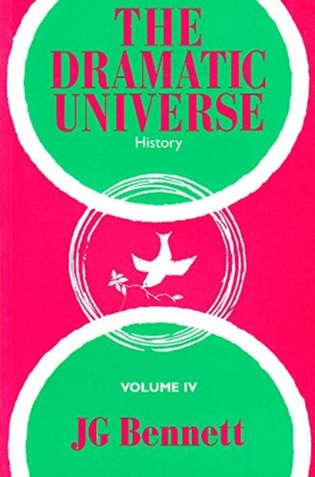

+++
authors = ["Josh Fairhead"]
title = "The Dramatic Universe Vol. 4: History"
date = 2026-05-03
description = "A review of John Bennett's fourth volume of The Dramatic Universe"
[taxonomies]
tags = ["Books"]
[extra]
card = "cover.jpg"
hero = false

+++

Wow, this is quite a book. Having justified the laws of framework in vol.1, the laws of synchronicity as well as developing the essence classes in vol.2, developing a theory of energy, anthropology and schema of ideal society in vol.3, we come to history in the context of the greater present moment in vol.4.

The greater present moment refers to a temporal framework that relies on the dimensionality articulated in book one, that being the three forms of time (cronos, hyparxis and eternity) as well as a spatial dimension that operates at multiple levels of encapsulation. In other words 'history' in this context is not a purely linear set of times and dates.

Just to express this in a manner that may be helpful, it might be said that we recognise the smaller present moment of our daily lives as an event happening here and now, but then there are many of these events also happening 'over there' with others and across differing periods of scale and degree.

It is this greater present moment from which Bennet articulates his form of history, using his framework of general systematics to develop multiple 'present moments' in the form of tetrads, seven to be precise.

The ground and goal of each relies on the essence classes of vol. 2 and the operational and directive terms relate to the time scales of vol. 3 and operations of vol. 1. This is expressed as tables and worked out in detail within the book, but for illustrative purposes here are the seven tetrads:

| Essence Class        | Goal                                                            |
| -------------------- | --------------------------------------------------------------- |
| Universal Harmony    | Supernatural History                                            |
| Cosmic Individuality | Providential History                                            |
| Demiurgic            | History of Soul                                                 |
| Human                | History of Mind                                                 |
| Animal               | History of Human Societies and Institutions                     |
| Germinal             | History of Conflicts, Conquerors and Achievements of Man        |
| Plant                | History of Man's Relationships with the Biosphere and the Earth |

| Essence Class | Ground             |
| ------------- | ------------------ |
| Demiurgic     | Religious History  |
| Human         | Cultural History   |
| Animal        | Social History     |
| Germinal      | Political History  |
| Vegetable     | Population History |
| Soil          | Edaphic History    |
| Crystalline   | Economic History   |

| Operational Class  | Instrument         |
| ------------------ | ------------------ |
| Monadic operation  | Action             |
| Dyadic operation   | Interaction        |
| Triadic operation  | Formation          |
| Tetradic operation | Growth             |
| Pentadic operation | Development        |
| Hexadic operation  | Transformation     |
| Heptadic operation | Creation           |

| Scale of the present moment | Directive influences             |
| --------------------------- | -------------------------------- |
| All Human History           | The Plan of Human Existence      |
| Great Cycles                | Stages of Human Evolution        |
| Epoch                       | Master Ideas                     |
| Civilization                | Cultures and Value Groups        |
| Nation                      | Regions, Races, Linguistic Units |
| Family                      | Clans and Localities             |
| Man                         | Personal History                 |

The range as you might tell is exceptionally broad, ranging from an Attenboroughesque account of the earths formation to the grand synthesis and cosmic plan.

The general theme of the book postulates higher intelligence guiding the cosmic evolution, with ample evidence of such an intervention provided. This sounds pretty ridiculous in many respects, but primarily because we are on the cusp of something we have not yet quite understood.

Keep in mind this book was written in the 70's and so is at least 55 years old at this stage, though still applicable to todays age. Without giving away too many spoilers with regards to the ending, it seems to offer a unique lens on the geopolitical situation of today, as well as what might seem like rather odd happenings such as the sightings of unidentified arial phenomena.

This is due to the transitional threshold crossing of the great cycles as we move from the megalanthropic epoch to the synergic epoch, suggesting that the master idea of mans inherent greatness, needs to be replaced with something more appropriate to the dawning of the synergic epoch and to accomplish this cosmic intelligence is once again intervening to show us how out dated our word views are.

Put another way, what was once called UFOs are now UAPs - a subtle shift from objects to phenomena - prepares the way for a move away from materialism to immaterialism and eventually revelation of 'the hidden directorate'. No longer necessarily 'men aware of their demiurgic nature', but the revelation of cosmic energy of which the demiurge consist.

Why you may ask? this is the master idea of the synergic epoch, what Bennett calls 'Structural collaboration' meaning the cooperation between man and the demiurge, possibly even beyond, which is seen as the true religion of all mankind.

What about wars? well the threat of these would seem to functions as a stick to align parties, nations and so forth into groups, which due to the dominance of psychostatic society need intervention. An example being the Mark Carney speech at Davos about aligning the middle powers in coalitions to rebalance the threats of hegemony. This would appear to be the work of unitive energy, or the 'cosmic individuality' pulling things together as an act of love in the world.

There seems to be so many answers in this book as well as many more questions. There are a couple of phrases that stick out to me, such as 'the intentional transformation of energies' and 'objects of worship'. If the transformation of energies is an intentional task, it begs the question of how - though this is perhaps somewhat revealed in the laws of three but difficult to apply in practice and would seem to give mixed results. Practically magic and requiring cooperation with higher energies, as well as discernment that seems to be beyond human capability.

As for objects of worship, we see things like cathederals and gardens. The former relating to the material energies, and the saviour culture, while the latter relates to the vital energies and mother culture. It begs the question of what kinds of objects of worship are most relevant to the synergic epoch?

Looking at the Eden project, the great mother culture is obviously present, for its the receptive ground from which everything is grown. But how does it synergise the other three cultures? The creator culture seems present in its impressive technical architecture, the great spirit perhaps in its communion with nature and spiritualisation from within the biomes, and the saviour culture perhaps in represented in the organisational structure, programs, supply chains and kitchens, as well as 'dramatic commitment' in its concerts? I would be interested to know more about their operational team for these reasons. It does seem to represent a balanced synergy representative of the synergetic epoch, and is perhaps one of the better examples of contemporary 'wonders' in comparison to say the hemanthic pyramids.

Honestly there is a lot to take in on this book, and it's quite frankly going to be difficult to remember without the Cosmic Ecology curriculum by Tony Hodgeson. These can be found in the H3uni vault on Github but you really need to consider them a supplementary summary of Bennetts book or they seem very interesting but lack a lot of context that only the DU series can provide in depth. Bravo on both!
