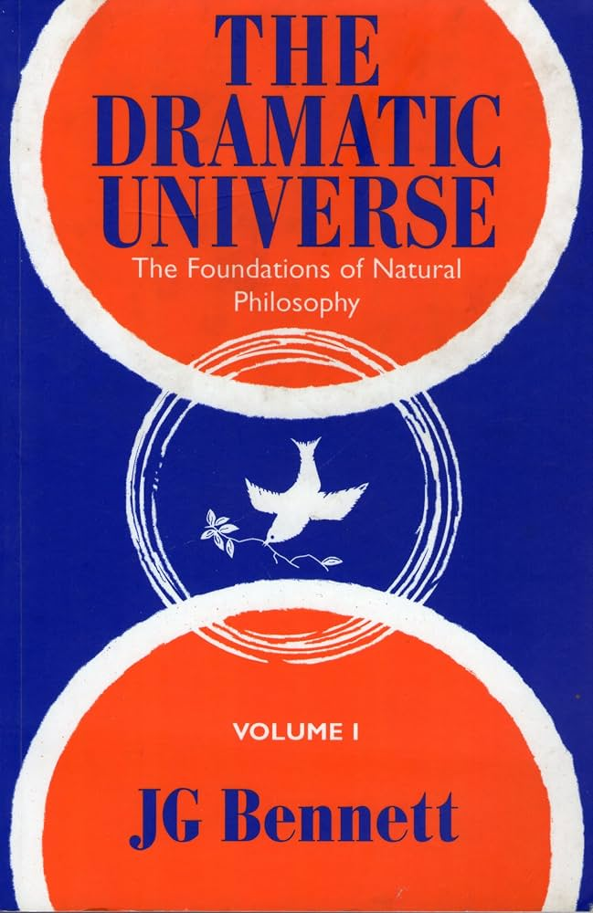

+++
authors = ["Josh Fairhead"]
title = "The Dramatic Universe Vol. 1: The Foundations of Natural Philosophy"
date = 2026-05-01
description = "A synopsis of John Bennett's first volume of The Dramatic Universe - the foundations of natural philosophy"
[taxonomies]
tags = ["Books"]
[extra]
card = "cover.jpg"
hero = false

+++

The first volume of The Dramatic Universe lays the groundwork that every later book leans on.

Where the subsequent volumes reach for moral philosophy, the nature of man and the shape of history, this one does the unglamorous but essential heavy lifting of establishing an invariant reference system — grounded in the qualitative/concrete significance of number — and then putting it to use.

The volume falls into two books: the first constructs the reference system — a set of categories, the determining conditions of experience, and the laws of framework that follow from them — and the second applies that system to classify the sciences themselves.

Starting with phenomenology, we can reduce phenomena to fact through the method of progressive approximation. This lets us articulate degrees of experience as categories that act as an invariant reference system, since facts themselves are homogeneous. To set the context for a categorisation of the sciences, we first need to briefly explain the categories of fact to which they will relate.

## The categories of fact

1. **Wholeness** — a persistent element standing out in awareness, an element that has the property of being what it is without internal differentiation.
2. **Polarity** — we see that this wholeness is relative and not the totality by contrasting it against what it is not.
3. **Relatedness** — contrast is not a true relationship, which requires a third element in order to enable a dynamic; this becomes the third category.
4. **Subsistence** — without instantiation through constraint the relationship remains abstract, so by grounding the phenomena in existence we give rise to the fourth category.
5. **Significance and potential** — since two contradictory possibilities cannot be copresent at the same time, this subsistence depends on a choice of potentials.
6. **Repetition** — potential in turn must be realised through repetition.
7. **Structure** — from repetition, structure emerges.
8. **Individuality** — from structure, self-direction and individuality can emerge.
9. **Pattern** — for multiple individuals to interact there need to be islands of coherence, sources of order within the environmental patterning.
10. **Creativity** — a pattern implies something that created the patterning.
11. **Domination** — since creativity is a polar act that creates order and disorder, it cannot be the ultimate category; it requires something to bring the two together out of necessity without participating directly in either. This is domination, a law that knows no law.
12. **Autocracy** — if domination reconciles forces out of necessity, then that law must be derived from a primary affirmation that is itself underived.

## The determining conditions

By reflecting on these categories we can identify the determining conditions needed to frame the totality of experience — that which separates the possible from the impossible. Here we find the condition of space, and three temporal dimensions: chronos, aionios and hyparxis. That is clock time, eternal or formal time, and recurrent time.

From these conditions we can deduce the laws of framework by relating each to its characteristic set of laws:

| Determining condition      | Laws of framework                   |
| -------------------------- | ----------------------------------- |
| Space                      | Co-existence                        |
| Chronos (clock time)       | Conservation and irreversibility    |
| Hyparxis (recurrent time)  | Correspondence and classification   |
| Aionios (eternal time)     | Statistical                         |

These laws of framework are the precise methods of science, and by extension technology. With the reference system in place, the first book of the volume has done its work.

## Classifying the sciences

The second book puts the system to use, combining the reference system with other tools to examine the sciences and confront seemingly intractable issues such as wave–particle duality. If we return to the categories of fact and apply a selection of existential hypotheses to them, we can derive levels of potential and use those to classify the sciences — with the framework laws then applied to each level in turn:

| Level | Existential hypothesis      | Science                          |
| ----- | --------------------------- | -------------------------------- |
| 1 Unipotent      | Existential indifference | Framework sciences              |
| 2 Bipotent       | Invariant being          | Polar sciences                  |
| 3 Tripotent      | Identical recurrence     | Particle physics and mechanics  |
| 4 Quadripotent   | Composite wholeness      | Chemistry and material objects  |
| 5 Quinquipotent  | Self-renewing wholeness  | Sub-cellular life sciences      |
| 6 Sexipotent     | Reproductive wholeness   | Cellular biology                |
| 7 Septempotent   | Self-regulating wholeness| Biological science              |
| 8 Octopotent     | Self-directing wholeness | Individuation / psychology      |
| 9 Novopotent     | Sub-creative wholeness   | Planetology                     |
| 10 Decepotent    | Creative wholeness       | Heliology and stellar physics   |
| 11 Undicipotent  | Super-creative wholeness | Galactic astronomy              |
| 12 Duedecipotent | Autocratic wholeness     | Cosmology                       |

The exceptions here are two transitional hypotheses that sit between levels: the colloid sciences fall between levels four and five, and the biospheric sciences between levels eight and nine.

At this point we have a categorically consistent way of classifying scientific activity, as well as an objective representational means for standardisation, interpretation, comparison and validation. This application of the framework to the sciences, examined with specially constructed tooling, is the substance of the second book which I'll leave to your imagination for now.
