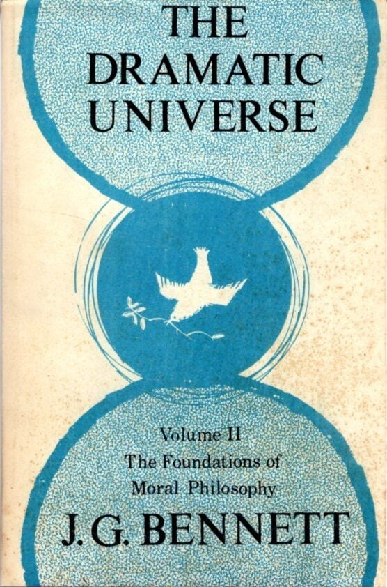

+++
authors = ["Josh Fairhead"]
title = "The Dramatic Universe Vol. 2: The Foundations of Moral Philosophy"
date = 2026-05-03
description = "A review of John Bennett's Dramatic Universe Volume 2 - the foundations of moral philosophy"
[taxonomies]
tags = ["Books"]
[extra]
card = "cover.jpg"
hero = false

+++



The dramatic universe volume two is not what I expected it to be, as one would think a book on the foundations of moral philosophy would be something along the lines of 'the ten commandments' or other prescriptive imperatives. Thankfully it does not do this.

The book starts where volume one left off, that is the determining conditions of the universe and the laws of framework - which are empirically verifiable - and then partitions fact from value before establishing the laws of synchronicity which are the values correlate to the laws of framework:

**The laws of synchronicity** (paraaesthetic experience)

| 1 initiating | 2 colouring | 3 outcome | Law                                         |
| ------------ | ----------- | --------- | ------------------------------------------- |
| Space        | Eternity    | Hyparxis  | The Law of Common Presence                  |
| Space        | Hyparxis    | Eternity  | The Law of Mutual Adjustment                |
| Eternity     | Space       | Hyparxis  | The Law of Organization and Disorganization |
| Eternity     | Hyparxis    | Space     | The Law of Multiple Existence               |
| Hyparxis     | Space       | Eternity  | The Law of Connectedness and Independence   |
| Hyparxis     | Eternity    | Space     | The Law of Normality                        |

These laws articulated we investigate the why, thus and how of Will as a pratition between essence and existence, before moving on to development of a set of triadic schemas that determine the laws of worlds. These triads incorporate the existential and essential elements and have different alchemical setups at different levels.

What struck me here was that this seems to be a true science of liberation, covering many experiential states that one can verify from their own experience. Theoretically, it seems there is an instruction set here that can help explain the requirements for moving from one world to another.

Admittedly this is not an easy map to understand, as it take the six triadic laws in pure form and then adds existential constraints found in different worlds to provide a comprehensive schema containing 96 different laws. This number seems significant and implies that it's probably a literal instruction set for anyone stuck in the basement of World 96 to find their way to higher levels of selfhood and uniting with true individuality. It even seems that he explicitly prescribes them though I'm not entirely sure I've understood the section:

```
Unlabelled figure on freedom:
3  -  2* -  1                          Inner freedom
      2* -  1  -  3                    Sacrifice or payment
            1  -  3  -  2              Inner effort
                  3  -  2  -  1*

Freedom leading to external result:
3* -  2* -  1                          Freedom due to external shock
            1  -  3* -  2*             Outer effort
                        2* -  1* -  3* Acquisition
```


As this is a simple review and reflection, I'm not going to explain the terminology like selfhood, will, acquisition and true individuality, as everything is provided in the glossary at the back of the book as well as explained and defined within it. Honestly a fair bit is beyond my comprehension or memory though it seems clear that it does indeed fit together.

Moving on from the Will and the triadic laws of synchronicity which that determine selfhood we get to the tetrad of Being we get into the world of energies partitioned into materiality, vitality and deity. This section discusses transformations such as anabolic and catabolic reactions and how energy moves from one level to another while setting out a schema of 12 energies.

This is followed on an excursion into the subject of creation, which seems to explain how creation occurs as well as its implications for morality, such as the principal of sorting the fine from the coarse - and how even evil is a necessary part of it. This is by far the most religious section in the book, as it is basically a creation myth that leans on scientific method to describe the process of 'genesis'.

With this process established, we return to the scales of existence previously set up in other books to discuss the spiritualisation of existence through the pentad. This is probably the most grounded section of the book and perhaps easiest to interpret. Bare existence is defined and higher and lower terms acting as transformers, while two levels above and below are essentially related to cause and purpose. Applied to the 12 levels as 8 cosmoses, one can easily make sense of much of existence in broad sweeps.

| Category of experience | Level of potency    | Quality of energy | Essence class        |
| ---------------------- | ------------------- | ----------------- | -------------------- |
| Autocracy              | Univese             | Trancendent       | Ultimate realisation |
| Domination             | Galaxies            | Unitive           | Cosmic Harmony       |
| Creativity             | Stars               | Creative          | Cosmic Individuality |
| Pattern                | Planets (biosphere) | Conscious         | Demiurges            |
| Individuality          | Man                 | Sensitive         | Men                  |
| Structure              | Organisms           | Automatic         | Animals              |
| Repetition             | Cells               | Vital             | Germs                |
| Potentiality           | Virsuses            | Constructuve      | Plants (Colloids)    |
| Subsistence            | Thinngs             | Plastic           | Soil (and water?)    |
| Relatedness            | Particles           | Cohesive          | Crystals             |
| Polarity               | Corpsucles          | Directed          | Simples              |
| Wholeness              | Hyle                | Dispersed         | Heat                 |

Most significant of the essence classes is that man is a germinal creature who 'feeds' on potential or 'germinal essence', who's lower nature is that of the animals. Our higher nature would seem to be that of the demiurge, which loosely defined corresponds to the conscious ordering impulse of the planet, or demiurge in service to the cosmic individuality (in a word: god).

Interestingly enough the end of the book discusses this cosmic individual, which roughly corresponds to god, and explains why god is associated with this essence-class which resides below the cosmic harmony and unfathomable source (ultimate realisation). Put loosely, as existential creatures we cannot know pure essence or even conceive of anything that is not existentially tainted, hence the final two levels are along the lines of the purpose of pure essential will - or gods plan.

Having laid out the foundations in this book, the discussion of values and mans place in the cosmos is set up. So the book on moral philosophy I thought I was about to read, is actually book three under the title 'man and his nature' - this instead seems to be the prerequisites, establishing the necessary invariants as a sort of map.

