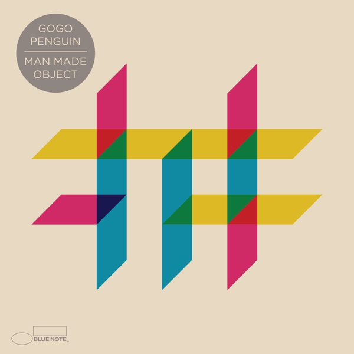
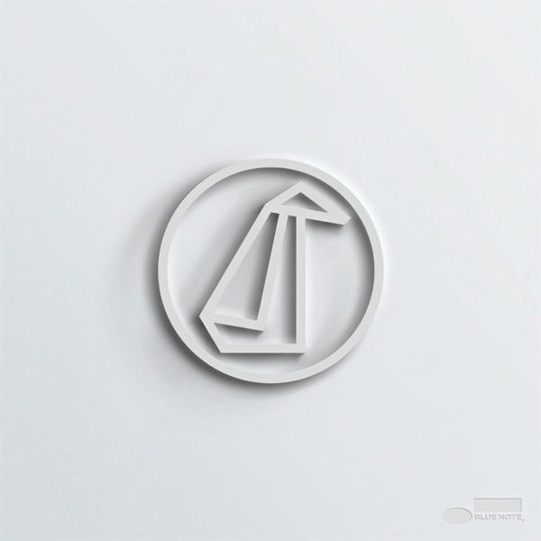
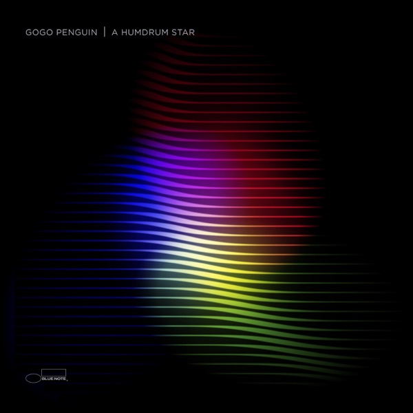
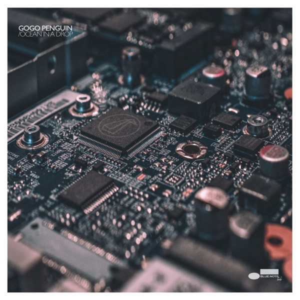

+++
authors = ["Josh"]
title = "GoGo Penguin"
date = 2021-11-20
description = "Manchester trio weaving crystalline piano, acoustic bass and breakbeat drums."
[taxonomies]
tags = ["Music", "Artist"]
[extra]
hero = false
card = "man-made-object.jpg"
+++

	

		<a href="https://youtube.com/playlist?list=PL6F539a8Tffc4J19QNn9JOss9K1HlNmrn&si=KYxbhYEDHFK8I7Fr" class="album-link" target="_blank" rel="noopener noreferrer">
			
			
Man Made Object

		</a>
	

	

		<a href="https://youtube.com/playlist?list=PLEz_mLoNZMeQ7gfgQurMatCo_a1523yX1&si=OU_dtulq8DET1gIa" class="album-link" target="_blank" rel="noopener noreferrer">
			
			
GoGo Penguin

		</a>
	

	

		<a href="https://youtube.com/playlist?list=PLFW6onB8bLzgv2W5BL-DgkoFCj7TDZDU0&si=R1WSzrVBHWabgkYV" class="album-link" target="_blank" rel="noopener noreferrer">
			
			
A Humdrum Star

		</a>
	

	

		
		
Ocean in a Drop

	

Albums: [Man Made Object](https://youtube.com/playlist?list=PL6F539a8Tffc4J19QNn9JOss9K1HlNmrn&si=KYxbhYEDHFK8I7Fr), [GoGo Penguin](https://youtube.com/playlist?list=PLEz_mLoNZMeQ7gfgQurMatCo_a1523yX1&si=OU_dtulq8DET1gIa), [A Humdrum Star](https://youtube.com/playlist?list=PLFW6onB8bLzgv2W5BL-DgkoFCj7TDZDU0&si=R1WSzrVBHWabgkYV)

These guys passed me by the first time I listened to them. It's not that I didn't like the music, more likely that I lacked the maturity to appreciate how good they really are. Or I listened to the wrong album and wrote them off too early. I'm revisiting them and am really really glad to be doing so. I've started with four albums and can see why I might have got the wrong impression.

I've been listening to 'A Humdrum Star', 'Man Made Object', 'GoGo Penguin' and 'Ocean in a Drop'. Humdrum is the cover that called my attention first, which may have happened before. It's good but the weakest of the bunch, and would appeal to those that like more ambient electronic elements in their music.

I'm torn to choose between 'GoGo Penguin' and 'Man Made Object' as albums, as they are both real winners. The former is more 'arctic' in its sound, with bright crystalline piano notes and the occasional tape delay effect, while the latter is somehow more playful, especially the second track 'Unspeakable World' which has a really annoying piano intro that is beautifully balanced as the track unfolds. Both these albums pan out really nicely, with Initiate being one of my favourites on MMO.

Ocean in a Drop is a little different. It's music for film, and only has five tracks, sounding closer to what I imagine is the band's 'normal sound' than Humdrum Star, yet lacking some of the character of the other two albums. Don't get me wrong, it's good, but the other two are REALLY good, quickly catching up to some of the well worn in albums in my library.
