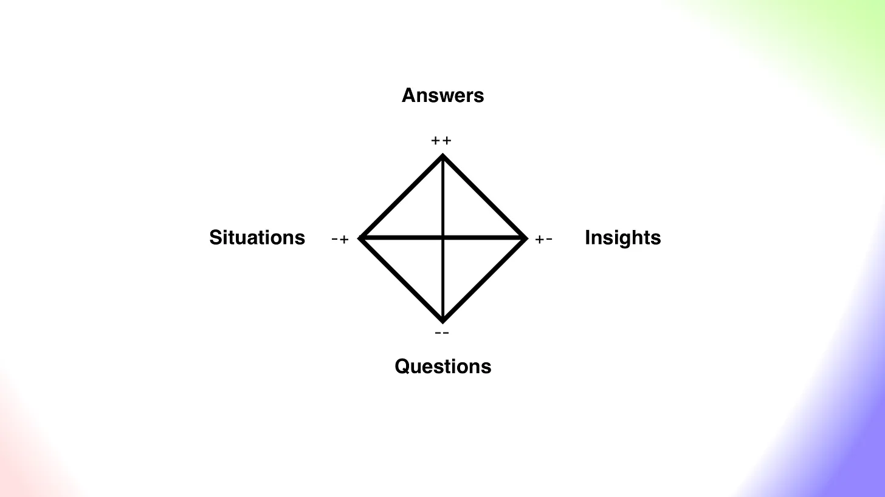
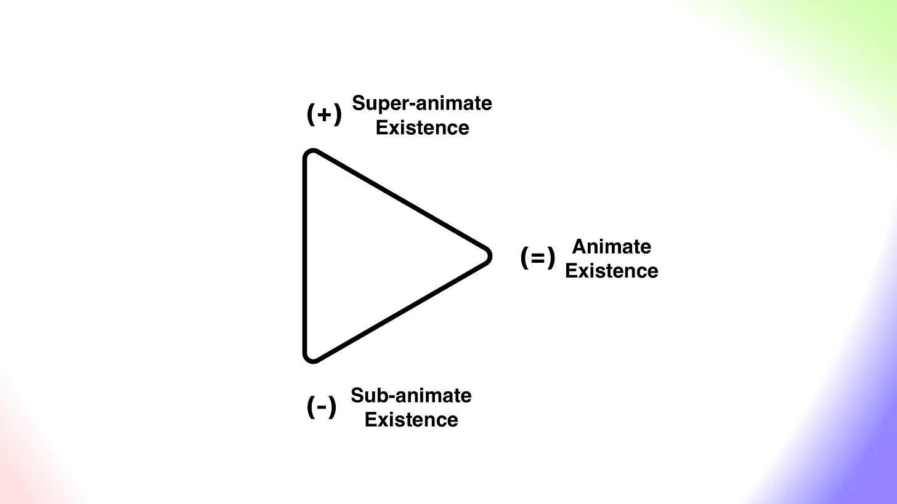
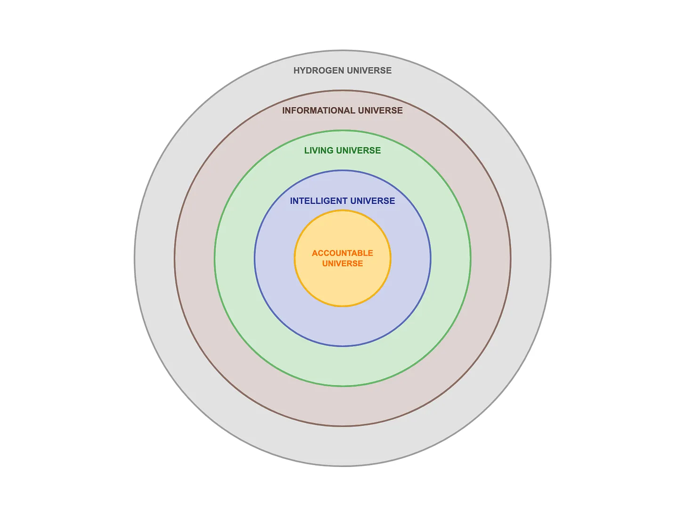
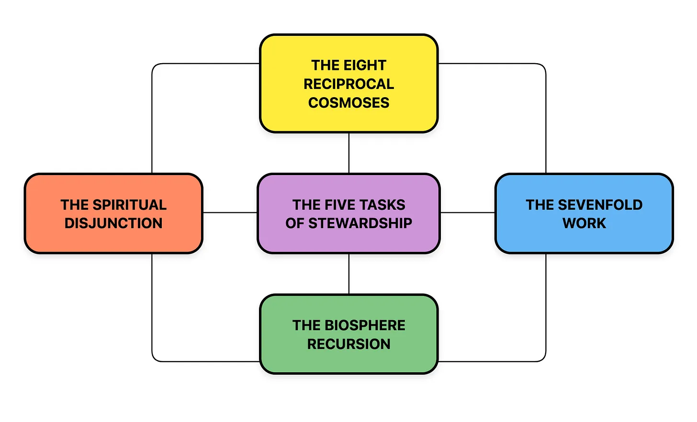
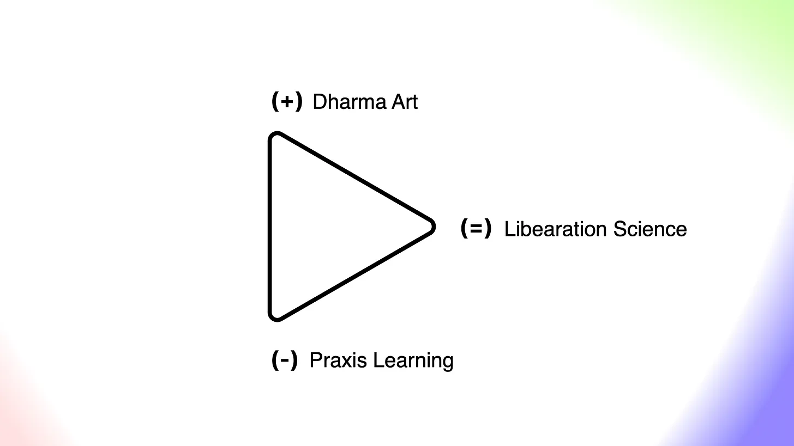

+++
date = 2026-02-21
authors = ["Josh Fairhead"]
title = "Explorations in Cosmic Ecology"
description = "Research Agenda"
draft = true
[taxonomies]
tags = ["Study"]
[extra]
card = "gnosticastronaut.jpg"
banner = "gnosticastronaut.jpg"

+++

## Research Agenda

This work is an investigation into the ephemeral structure of reality with an emphasis on the practical and applied aspects of cosmology in an encompassing attempt to orient towards Eudaimonia in a pragmatic way. This work is focused on the how and why questions relating to the praxis learning of an integral and applied cosmology.

## Approach

The picture of 'what' has been answered a million times in a million ways, reformulated processed and packaged according to time, circumstance and people - sometimes with transcendent beauty and other times in a storm of omniscient symbolics!

My intention is not to create an airtight articulation that steelmans a position against those who wish to argue over interpretations and representations, as the hard work of establishing invariant language and useful explanatory principles has already been established by others offering a set of colours and canvas to paint on, my intention is simply to learn through play by attempting to paint a picture with what has been left behind.

At this point in the creative process we are sketching a loose profile, where certain lines seem absolutely necessary and other elements more subjective or interpretive choices. No matter what, the output will hopefully be stimulating and enjoyable for any receptive audience, offering points of departure for those asking the essential questions, as well as perhaps an occasional meeting point or platform for seekers already somewhere down the rabbit hole in wonder land!

In regards to explanatory principles, this project will make use of geometric structures as its primary symbolic language - possibly further developing existing systems such as QualsSystems, Systematics and Synergetics. The point of such a language is to maintain an **objective frame of reference that enables meaningful subjective articulation through a shared symbolic language as well as coherence through relational structures**.

In other words, geometric structures applied to language enable us to discern an embedding space around the words we are using, and therefore offers a meaningful structure to what it is that is being gestured towards. Stripping away the linguistic element to just the bare geometry as a pre-symbolic living system is also relevant, but to speak of this accurately would mean I understood it properly.

## Points of departure

Cosmic ecology was chosen as a name in recognition of the Hodgson book, "An Introduction to Cosmic Ecology - Searching for a Meaningful Universe", which is best seen as a set of enabling constraints applied to the category of 'all and everything' in visual form.

While everything is effectively within scope, my attention is limited and generally drawn towards the applicability of cosmology in relation to worlds not yet described. For now it seems fine to summarise them as a triad of subanimate, animate and superanimate existence - which offers a very coarse frame that we will cover in more detail later.

Here I will remind the reader that the map is not the terrain, yet discussions about the map will have very real implications in relation to where we are going. If you encounter questions as we head off piste, be aware that one can most likely find a mapping back to Bennett's foundations or will at least have been provided specialist tooling to answer them for oneself.

As for the territory of our lived experience, we will relate this to dynamic interplay between questions, situations, answers and insights which will hopefully lead towards an integrated expression of thought, feeling and action that allows one to transcend the informational aspects of being over dogmatic reifications.

As such everything on this site should probably be considered Dharma Art and subject to question and self verification. This venture is likely to yield some bizarre expressions that hopefully gesture towards truth and beauty but is also likely to contain noise.

## Specifics

On one hand is the consolidation of fragments from the work of Bennett and Hodgeson (and perhaps Gurdjieff) which offers a supportive platform, and on the other hand I'm using this as a platform to develop my own understanding of what is really going on - and perhaps myself!

As far as the platform goes, Hodgeson offers a relatively scattered website of the best resources, a course that has completed, a recursive diagram that summarises the system of interest and a book that essentially offers several perspectives and a set of assessment criteria that exposes the limits of each perspective.

This foundation offers plenty of scope for exploration and so the intended artifacts of this research are essentially creative enrichments that will help others develop their own interest and understanding of this subject matter. Think of it as open source esotericism.

Beyond this work has been done to create an interactive system for navigating this categorical cosmology but it becomes apparent just how complex building such a compositional system actually is. It's possible that elements of the site will morph into an automated tool for process science, but there are some really heavy duty research questions to address that are beyond the scope of my abilities - even with the latest in AI technology leveraging the most abstract math known to mankind.

With that said I have a few hypotheses regarding how to 'cook up' such a system as Bennett seems to have been most purposeful and rigorous in his epistemology, anticipating issues and implicitly designing for them so that someone down the line may trust his judgement beyond the range of his justifications. In other words he 'buried the dog deeper' than one would expect.

My sense is that his choice of limiting systematics to two dimensions relied actually on a third to reconcile between systems. In other words to move from a three term system to a four term system is simply a change of perspective on the tetrahedron. The same is true of a transformation from a tetrad to a hexad, projective plane on the tetrahedron.

My sense is that this is how the geometric transforms work, simply rotate or move in vector space. But I do not understand quite how one would apply this to linguistic transformations. It's possible that his 7 Dimensions of experience might offer some clues:

1. Location—there is "somewhere here"
2. Separation—there is "somewhere else"
3. Rotation—there are multiple perspectives on "somewhere" and "somewhere else"
4. Succession—one thing happens after another and before yet another
5. Potential—of many possible things not all happen
6. Manifestation—there are relative strengths of happening
7. Connectivity—things seem linked to each other in mysterious ways

So this is also an element of research. If the laws of systematic transformations can be cracked and applied to his cosmology, it would probably be a good thing - there are some incredible breakthroughs happening in computing at the moment but it does all seem to be lacking coherent organising principles.

## Telos

Beyond the material presentation of this work one may ask why we would create such artifacts and so forth - which is a matter of Telos. What is the learning aimed towards and so on. This requires a deal of background context and a certain degree of understanding, so I will offer three broad strokes of Dharma Art, Liberation Science and Praxis Learning.

