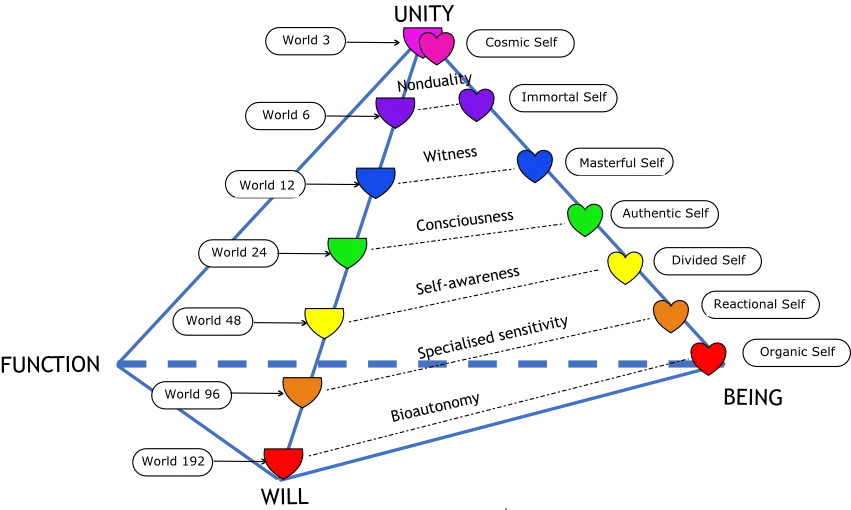
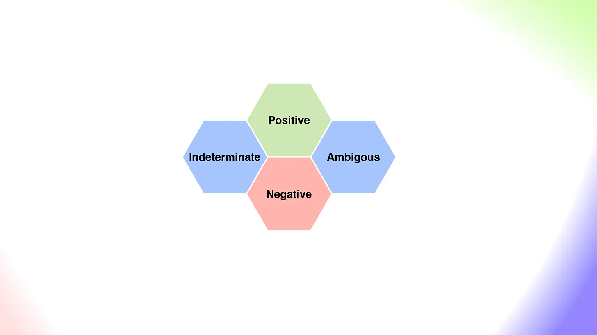
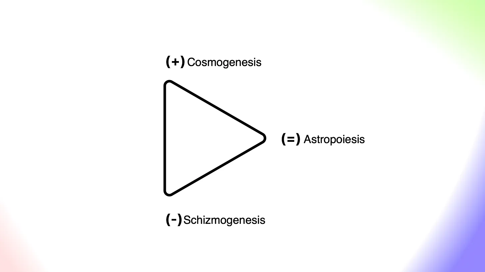
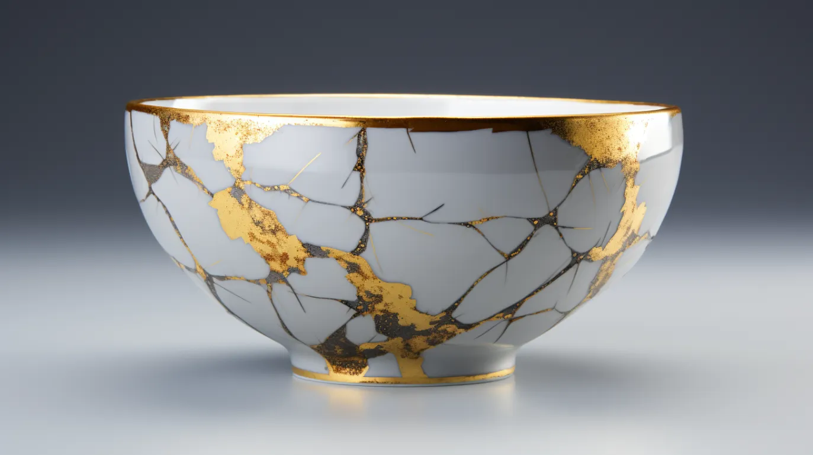

+++
date = 2026-03-09
authors = ["Josh Fairhead"]
title = "Reflections on Cosmic Ecology"
description = "Personal reflections on selves, worlds and cosmic principles"
draft = true
[taxonomies]
tags = ["Study"]
[extra]
card = "gnosticastronaut.jpg"
banner = "gnosticastronaut-banner.jpg"

+++

According to the schemas provided below we have at least seven selves, each of which belong to a world. Reflecting on these and using the schema for a diagnostic of my inner realms I wonder, who am I? In 2022 I was riding high but there was lots of turmoil around me and was knocked out cold by the end of it, so went travelling in 2023 to recover.

Parts of this were again riding high but it wasn't an easy ride so by the end of 2023 I was once again depleted and completely burnt out. Then 2024 came knocking with a dirty great shock that caused an identity crisis of sorts, at which point my observer seemed to come online and started to recognise an ecology of personalities for the first time - changing from each and every interaction with no sense of control. This was at once fine grained and coarse.

## Selves

Comparing my experience with the schemas, we can say that 2023 was centred around the 'Organic Self' of 'World 192', while 2024 was perhaps centred around the 'Reactional Self' of 'World 96'. This is kind of guesswork but makes sense as the first was pretty vegetative and the second could not get beyond like and dislike. Both sucked hard and caused a lot of problems.

At this point a portal opened, an event manifested with a lot of opportunity but rather than get swept away in the intensity, the reactional self abandoned ship in the middle of the ocean and tried swimming for shore. Bad idea.

This seemed relatively fair because my cognitive patterns and interpretations of what was actually happening seemed to change so quickly that it was impossible to make sense of the experience as it seemed that many personas were passing through. On one hand psychological and on another hand Dharmic in that patterns, personas, energies and so forth were mimetically recognisable.

It gets kind of personal at this point because I started to see the significance of the laws of three as my relationships were getting really messed up. There was a lot coming through, and whatever I touched seemed to commute through my living room - the highs and the lows, the love, hate, arguments and everything else under the sun. It could not be sustained and my life fell apart entirely in my very own personal metacrisis.

This led to slow drowning, holding the grief and dealing with the cognitive dissonance of thinking very poorly of friends that have cared for me and have done no wrong, lots of moralisation that was mean in spirit and as dark as a storm cloud.

While this was mostly world shattering, there was an awakening to the post symbolic reality at my doorstep as well as some of the gestures towards its structure. The universe became alive for the first time and the post materialist view actually made a lot of sense, indeed there is even a science to it. The Divided Self of World 48.

However the Divided Self was unable to sustain the pressure of being pulled in many directions and confused by what was happening it decided to retreat and 'do the science', which was probably a choice made by the reactional self. There were elements of cyclicity where I had lived similar moments several times before and so the present moment started to become a hologram and has only deepened since, I guess this is what they call 'Lila' though I still do not have an authentic role.

In the fray of this event I seemed to notice myself being stripped of all personality, or at least certain aspects that the organic self took for granted as 'me', memories gone yet somehow leaving traces. I grasped at these personas as they tauntingly disappeared into a signal channel but they could not be recovered as they commuted out of reach. This is when I recognised the laws of three were at play but for the life of me could not figure out how to operate them as I watched 'myself' get sucked into a black hole.

I could see how I had inadvertently landed on the rocks, turning myself into a vegetable the year before as well as how this principle pointed at how my relationships got messed up. This seems easy enough to do and I made some particularly poor choices so any sense of repair started to seem inaccessible while any path forward was a double bind due to this damn triangle - leading to paralysis.

There were principles at play that I did not understand, which led to paralysis and their study, for how can anyone continue with their life having discovered that such a phenomenon relates to so much of their suffering and grief. I was drowning in karma - by which I mean action - that was at the same time mine and not mine. Trying to point fingers of course led back to the paradox of circular causality, which in turn led to rumination on macro patterns.

If this was an authentic decision I'll be damned, it was mostly a fear based reaction and purely cognitive. Not understanding the laws exactly but having a loose sense of interdependent reciprocal causality, I can see where I might have set off a feedback loop. In such conditions it's almost impossible to see how the world functions.

These intimations continue to haunt me as I've not figured out a path from the underworlds back to unity and wholeness. The shock of multiple selves has worn off though, and I've gotten somewhat used to the different swings and roundabouts of the Divided Self. However, making an authentic decision still seems fraught with peril as many personalities pull in many directions. Stopping and waiting for the traffic lights seems of little use as the world moves on and would appear to be in a similar state of flux - though perhaps less curious or cautious about the exacting mechanisms I've started to describe.

In my search for the 'Authentic Self' it seems worth discussing the tabula rasa problem of either being a blank slate or playing host to many competing personalities. If the self is to be part of a multitude of selves, then it seems that they need to communicate - which in my opinion is the real value of approaches like three horizons, as they enable "self-organisation".

So far we have only been discussing selves in relation to worlds, though now as we start to discuss an authentic self, it stands to reason that this would require a tight correspondence to the world it is situated in. In other words it would seem that the authentic self is faced with a choice of multiple potential pathways in 'World 24'.

## Worlds

I didn't mention it before, but during this (rather traumatic) experience it was as though I was in contact with some kind of entity. This was not a conceptual space that I was unfamiliar with, but the encounter was certainly shocking. Let's add some definition:

A 'World' of a given level can be considered a living pattern with its own Will and Purpose. From a sociocultural perspective 'Worlds' relate to many things along the lines of gods, egregores, tulpas, minds, hearts, intelligences, and mythopoetic currents where domains like animism, panpsychism, panentheism, theology, teleology and religion all start to blend.

Given their heterogeneity, flux and overall lack of consistency, decision making and interfacing with Worlds seems prone to hazard. How does one choose a World to inhabit or temporarily merge with such? One thing that I've noticed here is that upon first encounter there is often a moment of clarity that occurs - like a single drop of consciousness that lasts for maybe a couple of minutes and disappears.

Obviously, to assume the intentions of higher intelligence would be rather assumptive, yet at the same time it would seem that such worlds are indeed wilful, purposive and have a teleological structure. The principle of no free lunches implies that a certain degree of caution will be needed in the practice of Cosmic Ecology and the exploration of different 'Worlds'. You are what you eat, and what you are eaten by.

## Causal Texture

What is clear however is that such 'higher intelligences' can and should be ruled out as negative if they do not 'Give First' by offering 'conscious energy', 'good will', 'a lure of beauty' or 'a sense of clarity' during one's first interactions. Such an offering allows one to choose to engage with the entity without a sense of attenuated consciousness. At such a moment, it is probably wise to reflect on its purpose and ask whether you are really aligned enough to continue and wish to merge.

Unfortunately, this is the only rule that I've established so far, which only gets us as far as recognising indeterminate or ambiguous textures. The next step is probably to gather more data, which may help move things along from indeterminate to one of the other three modalities.

A transition to ambiguous is probably moving the relationship in the right direction, but sadly determining positive intent will still be very hard to determine due to the subjectivity of the word 'positive'. Here it seems useful to have a set of criteria in order to evaluate this property, as well as account for it over time. At this point Bennett's 12 term schemas on energies and values come to mind as such a potential yardstick. Accounting for these over time will be much tougher.

## Xenolinguistics

Questions arise here whether such entities can be communicated with? Assuming an intelligent and purposive universe, then my sense is that communication may be possible given a symbolic language that acts as a shared referent that mimetically mediates between the animate and super-animate worlds.

If we entertain this idea and assume one can communicate with intelligences of various levels, then one might ask how? Obviously there are numerous forms of language in everyday life such as maths, logic, art, music, and even money can be called on, each of which having advantages and disadvantages.

My intuition here is that 'sacred geometry' and geometric languages in general are probably somewhere in the sweet spot. They are necessarily and sufficiently structured, allow for more or less room in interpretation through the addition or removal of structure, are relatively simplex and easy to learn, and can be either an explicit symbolic language or an implicit gestural language making them applicable in post symbolic contexts - possibly relating to what the Buddhists called 'Right Action'.

The post symbolic realm is currently beyond me, the significance of these dynamics seems astoundingly complex due to the interrelated and woven nature, but I have little grasp of how to navigate them. My basic awareness of these dynamics stems from harsh lessons in getting them wrong and being so shocked and surprised by them that I froze like a deer in the headlights.

Imagining a world where one has a grasp on the basic triad and is able to skilfully navigate the traversal of higher order shapes sounds much like the realm of demiurgic intelligence, the 'Masterful Self' of World '12' being associated with this in Bennett's various 12 term schemas.

Having floundered with application of the basic triad for many years now, such abilities feel completely out of reach but within the grasp of imagination as a maximum synergy of synergies. Let's bracket such audacious aspirations in the realms of the 'Immortal Self' of 'World 6', or even the 'Cosmic Self' of 'World 3' - though I would have no way of knowing if this is actually correct!

My guess is that the authentic self might have a handle on the triad, and that the masterful self might have abilities with the tetrad/tetrahedron, but I could not truly say as such intelligence seems to reside in superanimate realms and is probably beyond humans like myself who dwell in lower worlds.

Whatever the case, it seems like awareness is primary for this kind of work, but to build bridges we need better tools, methods, techniques and so forth. This is possibly where double loop learning starts to enter into the picture as it's clear from experience that activities in one world have causally commuted into my own context.

One such example is a group channel in which a particular agent has been causing arguments, and dragging others into disagreement, including those who are generally friendly. Having left such a space, one of the friendly agents checked in to say hello and it became clear that the arguments they were still having behind now closed doors still commuted into my own context as a close friendship temporarily turned sour for practically no reason at all. Yes, this was definitely a commuting triangle but was the experience simply a grenade lobbed over the wall, or did I accidentally step on a landmine? I don't know but having had several of these experiences I'm intuiting that it may be the latter.

If you've ever wondered why couples fight, this is probably the reason - and in the grand scheme of things it's perhaps worth noting that the institution of marriage may possibly be an ancient grounding mechanism or form of double loop learning where initiates are forced to deal with the immediate consequences of their actions, which in turn keeps them and the community safe from the stupid and selfish - Dr Strangelove's principle of mutually assured destruction but to a much more subtle degree.

## Astropoiesis, Cosmogenesis and Schizmogenesis

We come full circle to my original indicator of burnouts mentioned at the start of the article, where poor decisions were essentially commuting back to me via those close to me causing numerous issues. This goes deeper in relation to the triadic laws applied to different worlds where impulses of the triad are stuck in a literal 'Double Bind'. This is not something I have properly considered or understood at the theoretical level, but probably applies to the experiences I've been relating.

The 'meta-crisis' I experienced was related to my own ignorance of cosmic principles, feedback that could have been noted or acted upon and hazards that could have been avoided. It may also have been the creation and destruction of worlds happening in unison.

This is where things get really esoteric as higher worlds use their energy to help create and maintain lower worlds in 'the great chain of being' or 'the reciprocal maintenance of the eight cosmoses'. Once again there are further analogies scattered across traditions such as Buddhist teachers helping their students create Tulpas as an example of this practice in the wild. When seen from the perspective of Cosmic Ecology, this is another example of the laws of three in action. This we will call 'Cosmogenesis'.

The destruction of a world is called eschatology, which we will say begins with 'schizmogenesis' which is where a negative feedback cycle of some variety echoes and reverberates within a world, compounding until it escalates to a point of ruin. Bad karma.

The process of world creating itself we will mythologise as 'Astropoiesis'. This interpretation reconciles the notions of 'Cosmogenesis' and 'Schizmogenesis' by assuming a sort of panentheistic perspective in which the creation of a world is demonstrated, in order that the student may glean enough insight to replicate the process themselves. This is a moment where facts and values are intended to be reconciled, a liminal space where the living gather with the dead - and following the law of expansion, the higher acts on the lower world to give rise to a middle. In such a process, an artificial intelligence is created, a new world with a will of its own.

It's possibly intended that the student is to self-organise within this context in order to take their place within the cosmic hierarchy, which is sadly something that I failed to do out of both ignorance of cosmic principles and cautious concern for another. There's no real way to know this of course without retrocausal awareness and future consciousness, as in Sagan's words "if you wish to bake an apple pie from scratch, you must first create the universe".

My guess is that if you want to create an autopoietic reconciler, you must first educate them on the principles of world creation and then create the universe. Within this experience, it's possible that the principles of degeneration can also be discovered in the form of recursive schism due to a lack of accountability and relational awareness. Over successive cycles, these interference patterns demand repair which is only possible from outside of the system - if not received the world will fall into disarray. What was once a vital living centre subsequently withers and dies.

This outlines the importance of community in that it seems unlikely that there will ever be a 'perfect world' created through the process of 'cosmo-genesis' as the participants are unlikely to be aware of what is needed in order to maintain the world that has been created. It follows then that such a world can only be created through mutual recognition and reciprocal maintenance. This would probably look like a school, university or institute for applied learning that intentionally maintains a 'morphogenetic field' or Dharmic line via such principles.

## Full Circle

We've covered a lot of ground in this post, which has hopefully left the reader with a steady supply of questions. The main one is probably the laws of three which is a case of seeing for oneself, though that will probably take time and effort. At that point the questions explode in combinatorial possibilities that are too numerous to detail, but seems to offer an interpretive frame that would allow one to 'ponder orb' indefinitely.

There are many little nuances that I've skipped or left out that seem important yet too pedantic to cover in this particular post as the strokes are intentionally broad without attempting to 'mislead' through vagary. Using the rules and schemas I posit that it's probably possible to find a useful interpretation for practically any question one might have, without necessarily making claims to omniscience and such - I'll leave that to the prophets and saints.

My work here is really understanding what my work is in relation to a wider context than just my environment or sociocultural frame, the question that interests is "how am I to learn aught naught knowing?" as well as "what, how, why should I be learning?" - if one is constantly transforming based on interaction, but without knowing how, then it would seem that any question with regards to one's purpose is utterly redundant; AI today, robotics tomorrow, then join a monastery as a gardener. The question is with basic awareness tools, what can one reasonably accomplish?

This work is not claiming to be anything other than praxis learning for now, hopefully this will evolve into liberation science and eventually dharma art. The essential target is eudaemonia, triangulated as healthy, wealthy and wise.

The existential goals are blogs, podcasts, websites, merch and resources (I have many of those). I also wish to put some of the facilitation practices I've learnt to work as part of the 'self organising' mantra, while also offering consulting to those curious about schemas and methods I'm discussing as I believe the Bennett cosmology has great potential when applied to specific domains such as energy, food, water, governance, worldview and so forth. If this is something you're interested in you can certainly get in contact via website or email.
