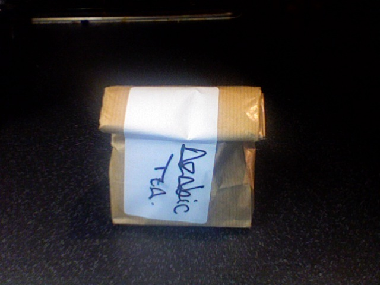
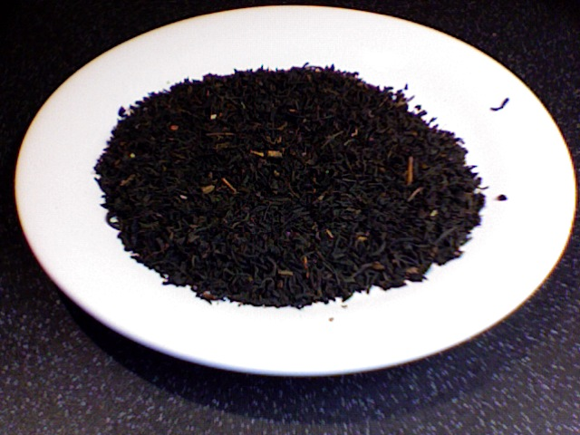
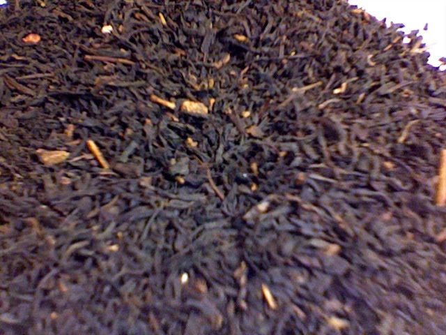

+++
date = 2010-02-20
authors = ["Josh"]
title = "Arabian Tea"
description = "A spiced black tea blend with cinnamon, featuring thin texture like Darjeeling with Earl Grey-like strength and chai characteristics."

[taxonomies]
tags = ["Tea", "black-tea", "spiced", "chai", "cinnamon"]

[extra]
card = "image1.jpg"
+++

  
  
  

This is a mix of unspecified black tea with things like cinamon ant other spices in it.
On first tasting its texture is quite thin like a Darjeelings or herbals would but with a bit more strength similar to Earl Grey and a flavour obviously leaning in the Chai direction.
Despite only being a person for normal black teas this Earl Greyish Chai isn't too bad. If your into your milky Chai then you could probably mix it with milk in a similar fashon but for me its just a variant on black tea.

## Tea Details
- **Rating:** 7/10
- **Price:** £5.60
- **Quantity:** 100g
- **Retailer:** Terra Nera Tea Boutique
  - Location: Camden Market, London, UK
