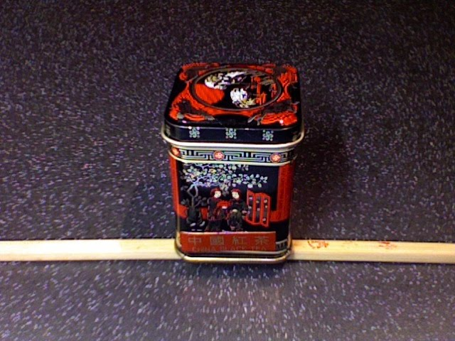
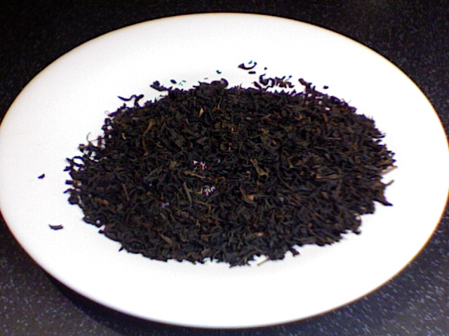
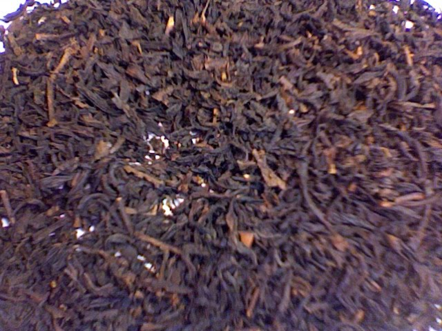

+++
date = 2010-02-25
authors = ["Josh"]
title = "China Black Tea"
description = "A very earthy Chinese black tea with thin texture, rubbery rather than floral character, and oil-forward flavor profile. Received for free and rated accordingly."

[taxonomies]
tags = ["Tea", "chinese-black-tea", "china"]

[extra]
card = "image1.jpg"
+++

  
  
  

Very earthy tea, texture similar to darjeeling.
Very thin texture with the oils giving nost of the flavour. Wouldn't drink in the morning or very regularly but is drinkable. Glad I got it for free...
Think rubbery rather than floral darjeeling

## Tea Details
- **Rating:** 4/10
- **Price:** Free
