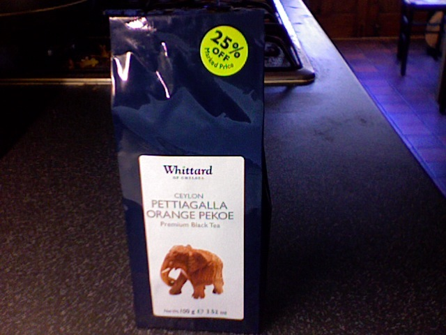
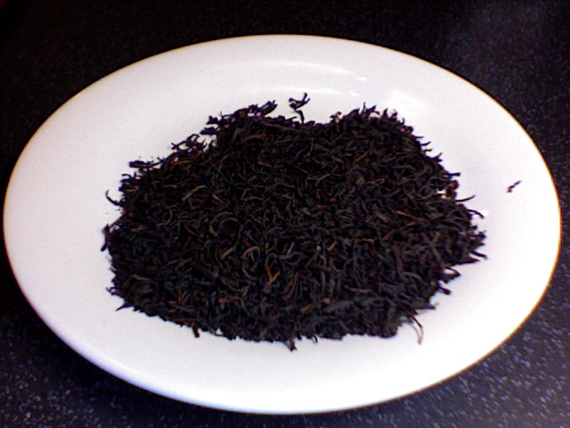
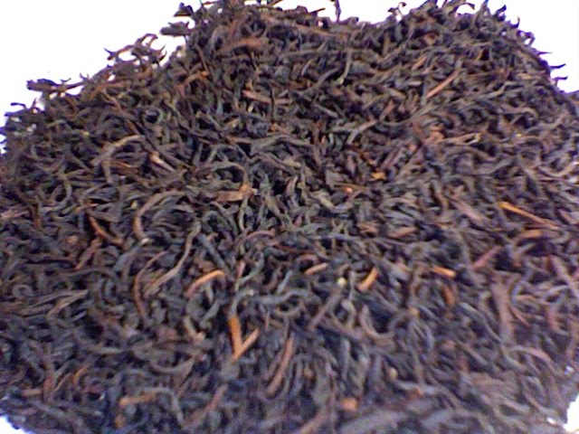

+++
date = 2010-03-15
authors = ["Josh"]
title = "Pettiagalla O.P. Ceylon"
description = "An exceptional fruity Ceylon Orange Pekoe with Darjeeling-like texture but more body, featuring subtle orange undertones. Described as 'bloody good tea' and the reviewer's new favorite."

[taxonomies]
tags = ["Tea", "ceylon", "op", "orange-pekoe"]

[extra]
card = "image1.jpg"
+++

  
  
  

This is some bloody good tea...
It tastes very fruity in a good way, although orange in the title is a reference to dutch royalty rather than the taste; however it seems to actually have a really subtle background taste of orange in it. Its similar to a typical darjeeling with its texture but has a bit more body. Some what of a medium weight tea and a new favorite for the moment.
"If god had dandruff it would be these tea leaves" - Darren Jennings (my flatmate)

## Tea Details
- **Price:** £6 (before 25% discount)
- **Grade:** O.P. (Orange Pekoe)
