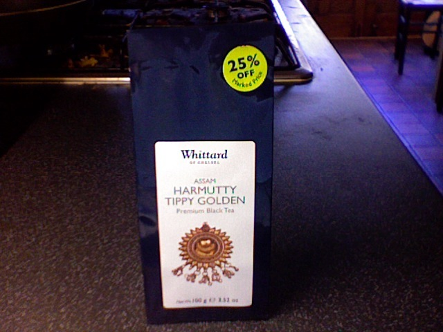
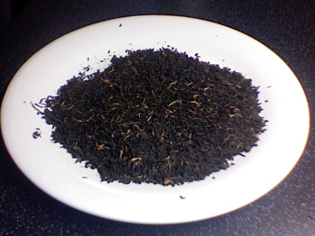
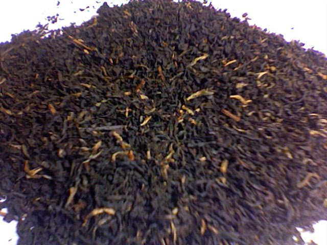

+++
date = 2010-06-06
authors = ["Josh"]
title = "Harmutty Tippy Golden Assam"
description = "A disappointing Assam that was very moderate and lacked real taste, reviewed retrospectively after the product was already consumed."

[taxonomies]
tags = ["Tea", "assam", "tippy-golden"]

[extra]
card = "image1.jpg"
+++

  
  
  

To be honest I can't really review this since it was a while back that I drank it and took the pictures, its all gone now... Anyway I wouldn't really be to bothered with it, it was very moderate and lacked real taste.
## Tea Details
- **Rating:** Probably 5/10
- **Price:** £4.50 (without 25% discount applied)
- **Retailer:** Whittards
  - Location: Ealing Broadway mall, West London
