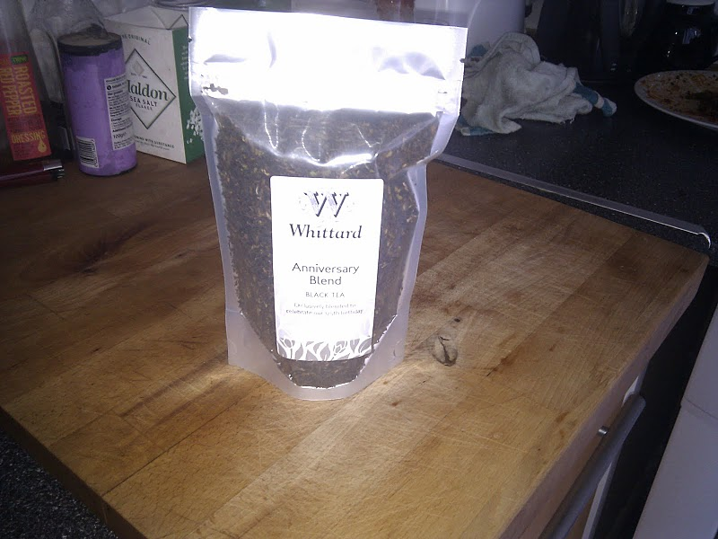
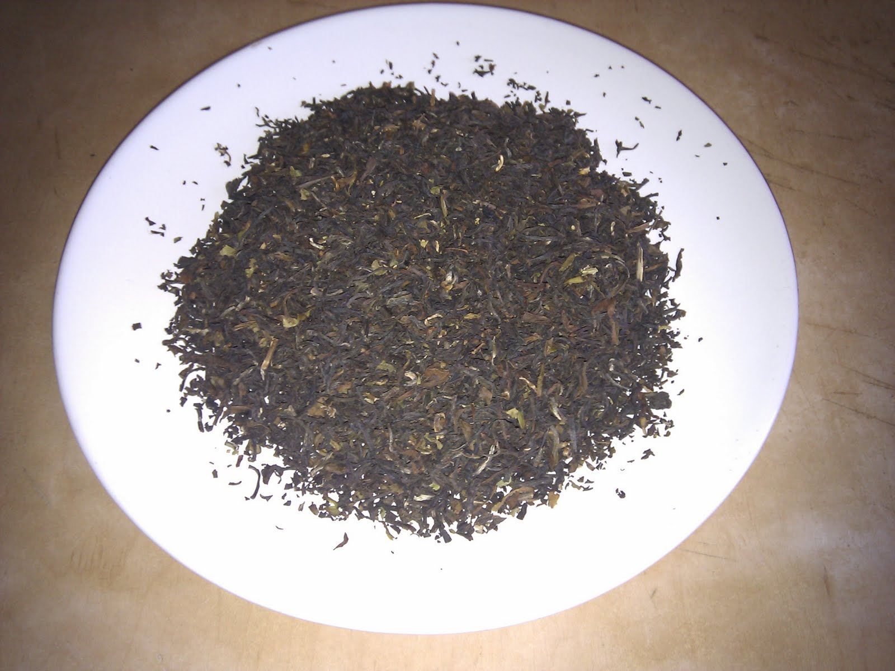
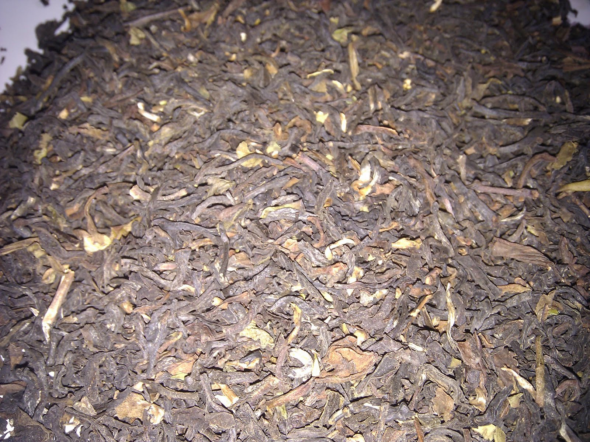

+++
date = 2010-09-14
authors = ["Josh"]
title = "Whittards 125th Anniversary Blend"
description = "A blend speculated to combine Ceylon and Darjeeling, delivering full bodied yet light taste with resistance to bitterness and woody-floral character."

[taxonomies]
tags = ["Tea", "blend", "ceylon", "darjeeling", "anniversary"]

[extra]
card = "image1.jpg"
+++

  
  
  

Although the shop assistant did not know what the blend actually consisted of, I would hazard a guess at it being a Ceylon blend mixed with Darjeeling; it has a full bodied taste while also being relatively light. One nice aspect is that it doesn't get bitter if brewed too long or if left to cool. Overall it has a slightly woody character with floral over tones lending to a nice high-midrange taste.
## Tea Details
- **Rating:** 7/10
- **Price:** £3.50
- **Retailer:** Whittards Ealing
