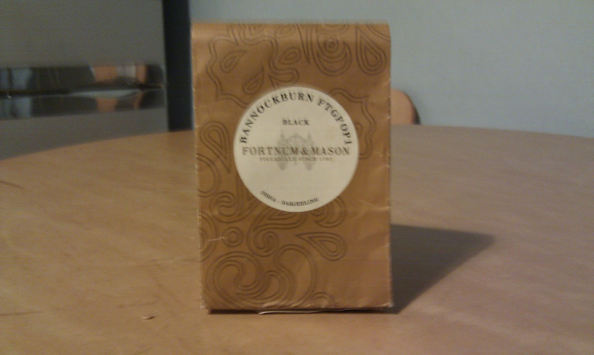
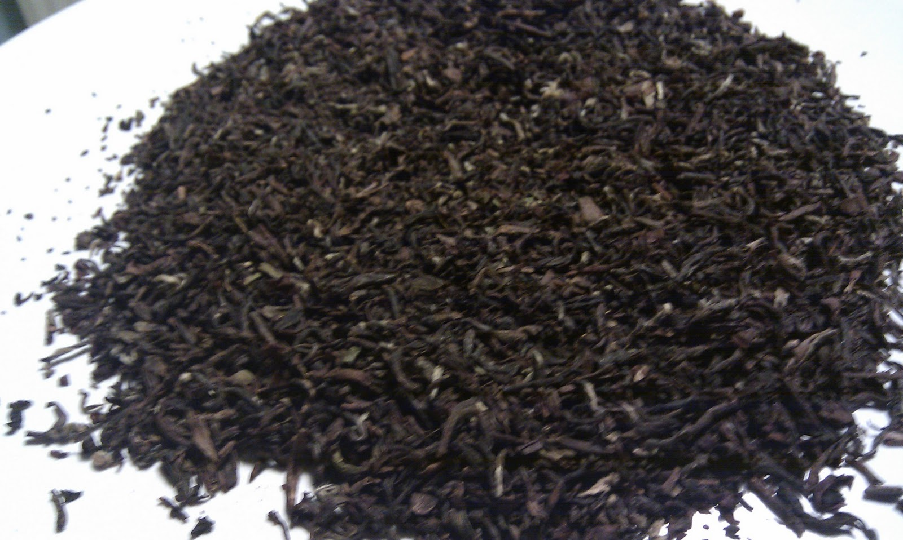

+++
date = 2010-11-24
authors = ["Josh"]
title = "Bannockburn FTGFOP1 Darjeeling"
description = "An enjoyable first flush Darjeeling with mellow, fresh, and light taste that lingers. Not bitter but could use more potency for the price."

[taxonomies]
tags = ["Tea", "darjeeling", "first-flush", "ftgfop", "assam"]

[extra]
card = "image1.jpg"
+++

  
  

This tea has an enjoyable mellow taste that lingers, thats also fresh and light. Not quite sweet but certainly not bitter, if it was a bit more potent it would be brilliant; instead its a moderately expensive cup of 'good' tea.

## Tea Details
- **Rating:** 7/10
- **Price:** £10
- **Quantity:** 100g
- **Grade:** FTGFOP1
