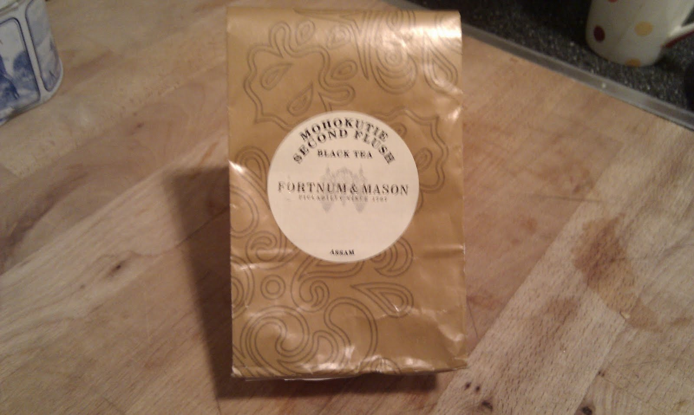

+++
date = 2010-11-29
authors = ["Josh"]
title = "Mohokutie Second Flush Assam"
description = "A high-quality Assam with the delicacy of a Darjeeling but more body and strength, featuring upper midtone flavors that create a subtle bite that's only just too sharp."

[taxonomies]
tags = ["Tea", "assam", "second-flush"]

[extra]
card = "image1.jpg"
+++

  
  

Bloody good assam which has the delicacy of a Darjeeling but with more body and a strength. Most of this strength comes from the upper mids but ideally it would be a bit lower to give a more rounded taste body, consequentially it has a subtle bite to it that is only just too sharp.

## Tea Details
- **Rating:** 6/10
- **Price:** £10
- **Retailer:** Fortnum & Mason, Piccadilly Circus, London
