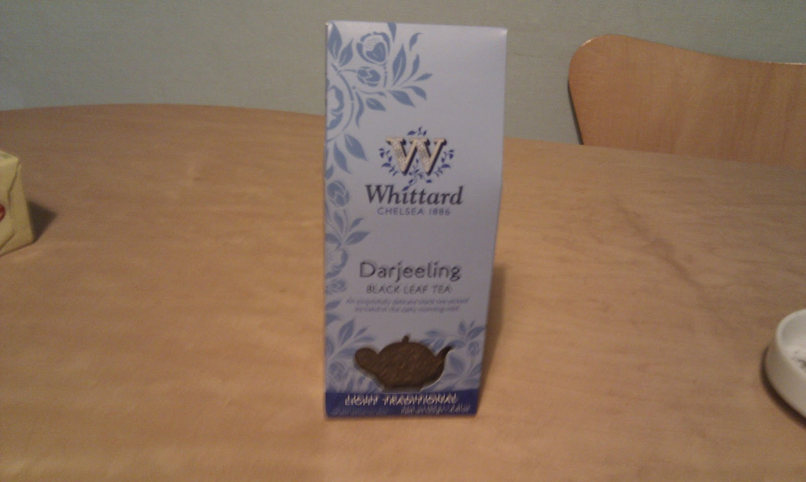
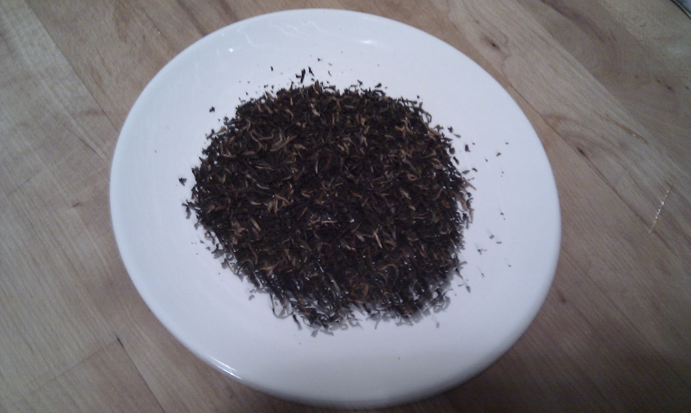
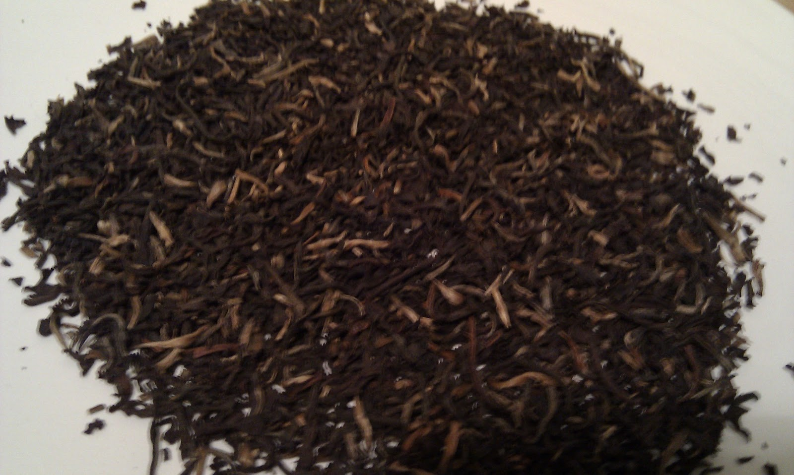

+++
date = 2010-11-29
authors = ["Josh"]
title = "Whittard's Darjeeling"
description = "A Darjeeling variety from Whittard's with product photographs but no detailed tasting review provided in the original post."

[taxonomies]
tags = ["Tea", "darjeeling", "estate-unknown"]

[extra]
card = "image1.jpg"
+++

  
  
  

## Tea Details
- **Retailer:** Whittard's
- **Tea Type:** Darjeeling
- **Estate:** Unknown
