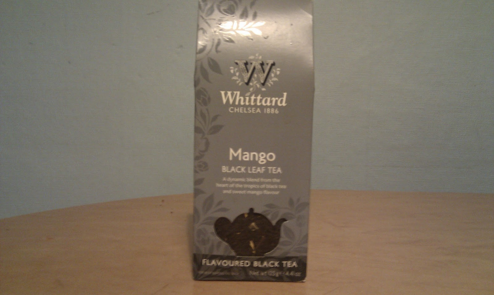
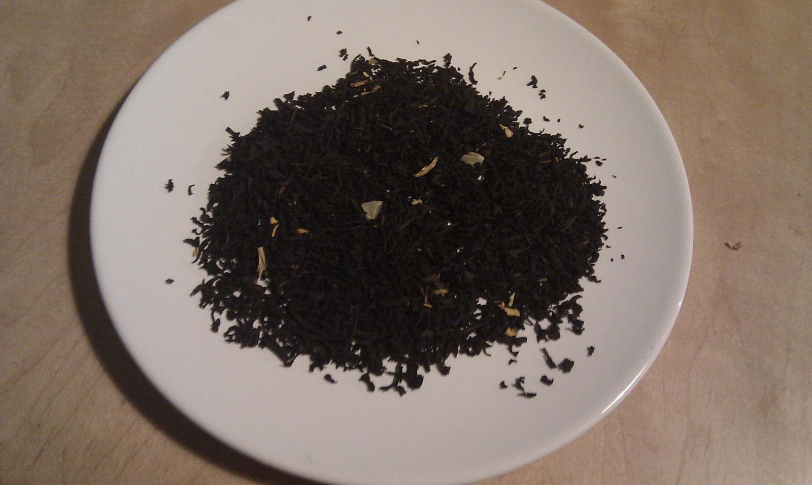
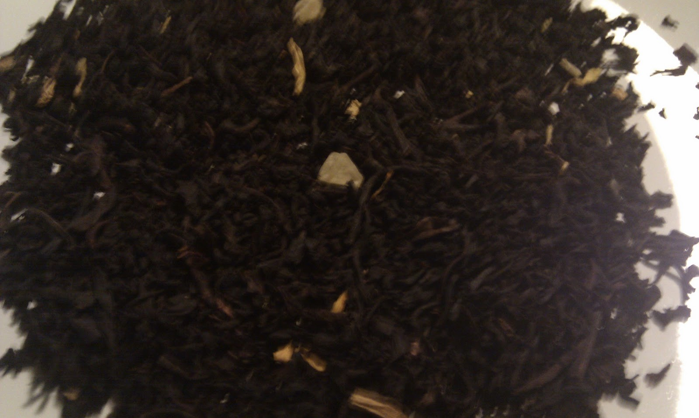

+++
date = 2010-11-29
authors = ["Josh"]
title = "Whittard's Mango Tea"
description = "Fresh and light fruity tea with Ceylon quality base, where the flavoring registers as general fruitiness rather than distinct mango. Better quality than typical flavored tea packets."

[taxonomies]
tags = ["Tea", "fruity", "flavored", "ceylon", "estate-unknown"]

[extra]
card = "image1.jpg"
+++

  
  
  

Fresh and light with a slight fruity flavour... Normally the actual tea leaves in packets like this are pretty poor disguised by a flavour, but not in this case the tea is actually alright (I'd guess a Celyon) and the supposed Mango taste is more a general fruitiness.
## Tea Details
- **Rating:** 7.5/10
- **Price:** £ (single pound symbol indicates inexpensive)
- **Retailer:** Whittard's
